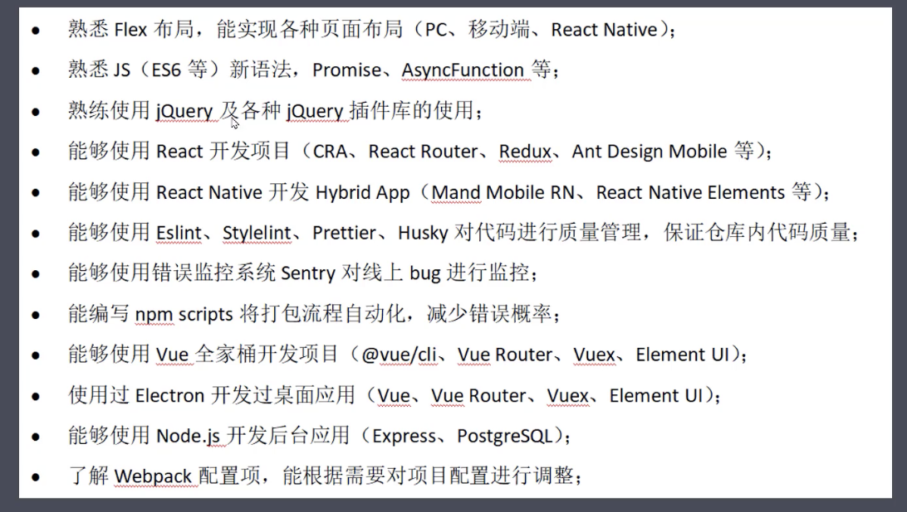
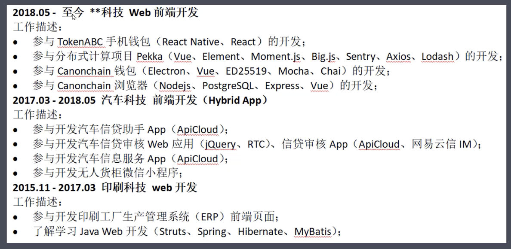
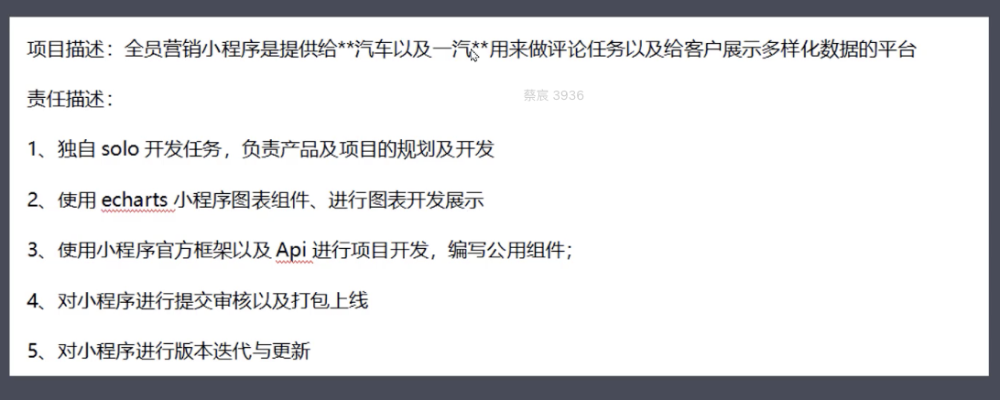
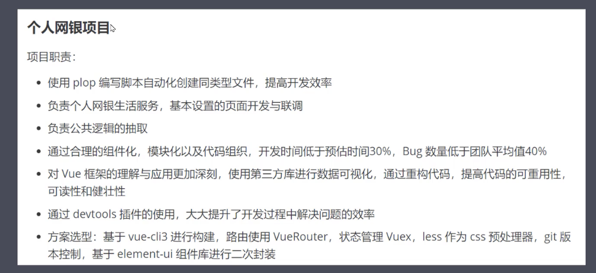
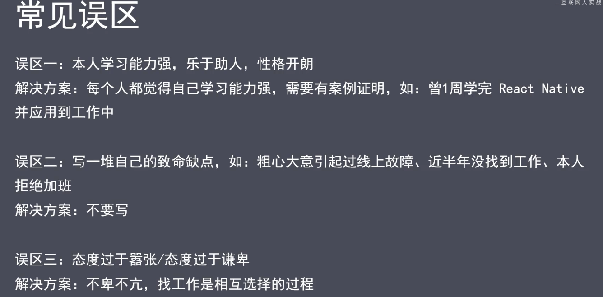
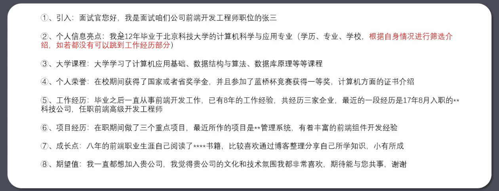
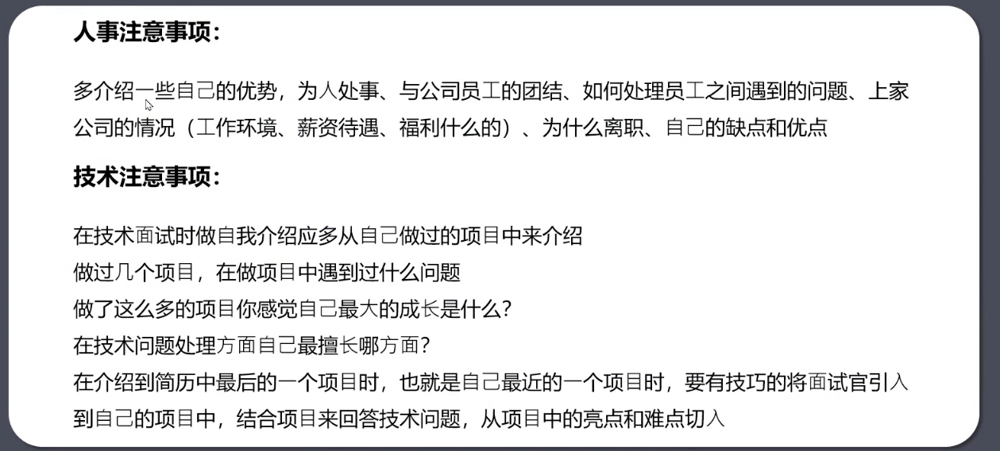

# 任务一：面试指导
## 1-1  前端职业规划
- 就业须知
- 面试准备工作
- 面试技巧
- 面试总结

## 1-2 就业须知
1. 
   - 了解前端就业方向
   - 公司组织架构
   - 未来职业发展方向
   - IT 技术面试流程
2. 项目类型
   - web网站
   - 移动APP
   - 小程序
   - 游戏
   - 桌面应用
   - 服务端

## 1-3 公司组织架构

## 1-4 职业发展方向

1. 初级前端开发
2. 中级前端开发
3. 高级前端开发
4. 前端专家/架构师

## 1-5 面试流程
 详见附件

## 1-6 面试前准备工作
1. 简历制作
   - 简明扼要
   - 去掉与找工作无关的内容
   - 去掉硬伤内容
   - 误区！！
     - 个人信息不是征婚信息
     - 工作经验与年龄不符，与教育经历的毕业时间不符
     - 不留联系方式
     - 学历一般，还往前放
2. 复习方案
3. 面试刷题
4. 在线简历

## 1-8 简历制作-专业技术
- 写上的技术面试时一定要hold住，不然会留下很差的印象
- 误区！！
  - 精通一切，了解一切（熟悉是个好词）
  - 罗列一堆技术名词 
  - 写的都是招聘方不关注的点（比如word、excel等）
- 

## 1-9 简历制作-工作经历
- 包含：公司名称、起止时间、职位、工作内容
- 写被人熟知的企业名称，突出自己的业绩和成长
- 误区！！
  - 罗列一堆公司的信息
  - 与项目经验内容高度重叠（要突出自己负责什么，获得什么成功；忌讳“参与需求开发，完成领导安排的开发内容”）
  - 诡异的时间排序，时间先后顺序凌乱，中间有空窗期
- 合理案例

## 1-10 简历制作-项目经验
- 写能体现自己技术能力的项目
- 突出技术解决方案
- 数量不贪多
- 误区！！
  - 把就业以来的项目都写上了，几天写完的小功能也写上了
  - 全程五一个技术名词，全是项目描述
  - 只罗列一堆技术名词（要写清楚每个技术应用的点，解决的具体问题是哪些）
- 正面案例

## 1-11 简历制作-自我评价
- 可以对自己进行总结
- 少些主观评价，写上的主观评价需要有例证
- 误区！！
- 

## 1-12 复习方案
- 简历内容必考，重点是最近制作的项目
- 岗位JD必考
- 面试真题（技术、HR）

## 1-13 面试刷题方式
- 力扣
- 牛客
- 学习积累（大厂面试真题）
- HR问题

## 1-14 在线简历制作
- 常用：拉钩、BOSS直聘

## 1-15 面试技巧-自我介绍
- 核心：扬长避短，别给自己挖坑，凸显优势，提高自身竞争力
- 面对hr进行自我介绍案例
- 
- 面对技术面试官自己介绍
- 
- HR & 技术
- 